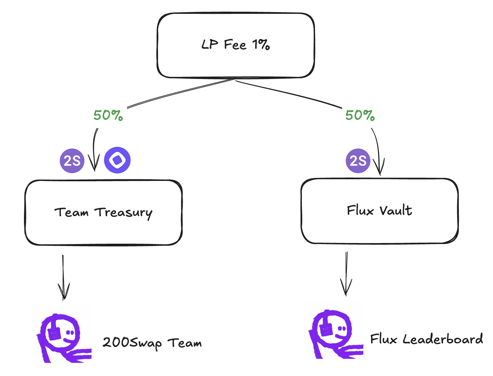

# 2S is Clanker Token

<figure><figcaption></figcaption></figure>

## Token Information

* Symbol: 2S
* Name: 200Swap
* Total Supply: 100,000,000,000&#x20;
* Deploy via [https://clanker.world](https://clanker.world/)&#x20;

## Launch Init Config

* Init market cap: 1,000,000 MON, about $32k with MON price $0.032
* Fee: 1%
* Prevent sniper in: 15s
* Dev bundle: 50,000 MON, used for future development purposes.

## Fee Structure

* 50% to Team Treasury by **both tokens: 2S and MON,** used for development fund.
* 50% to Flux Vault **all swapped to 2S token**, used to distribute to [Flux Engine](../core-features/flux-engine.md) every week.

<figure><figcaption></figcaption></figure>
